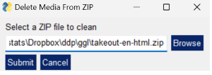

Row {data-height=350}
-------------------------------------

### Welkom

**Welkom bij CleanZIP**! Dit hulpmiddel is ontworpen om ZIP-bestanden te schonen door alle mediabestanden (zoals afbeeldingen en video’s) te verwijderen en alleen specifieke bestandstypen te behouden (namelijk .csv, .html, en .json).

   

Download gewoon het nieuwste bestand van de releases:

- **Windows**: [Download CleanZIP voor Windows](https://github.com/favstats/CleanZIP/releases/download/v1.1.8/CleanZIP.exe)
- **macOS**: [Download CleanZIP voor macOS](https://github.com/favstats/CleanZIP/releases/download/v1.1.8/CleanZIP.zip)
- **Linux**: [Download CleanZIP voor Linux](https://github.com/favstats/CleanZIP/releases/download/v1.1.8/CleanZIP)

Row
-------------------------------------

### Gebruik

1. **Selecteer een ZIP-bestand**: Gebruik de GUI om het ZIP-bestand dat u wilt opschonen te bladeren en te selecteren.

   

   
2. **Verwerk het ZIP-bestand**: Het hulpmiddel verwijdert alle bestanden behalve die met de extensies .csv, .html en .json (zoals ingesteld).

3. **Bekijk Resultaten**: Er verschijnt een popup die u informeert over het succes, en u kunt het schoongemaakte ZIP-bestand op de opgegeven locatie bekijken.

4. **Het ZIP-bestand is klaar**: U kunt nu het nieuwe bestand indienen, met de extensie `_cleaned.zip`.

---

<footer>
  &copy; 2024 CleanZIP Project. Contact: Dr. Fabio Votta (f.a.votta@uva.nl) Alle rechten voorbehouden. | <a href="https://github.com/favstats/CleanZIP" target="_blank">GitHub</a> 
</footer>
